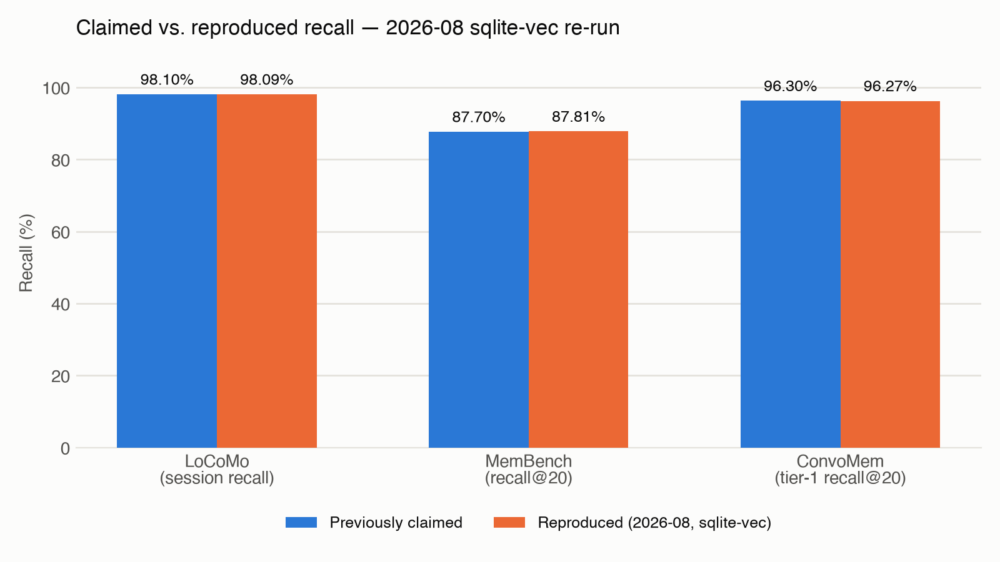
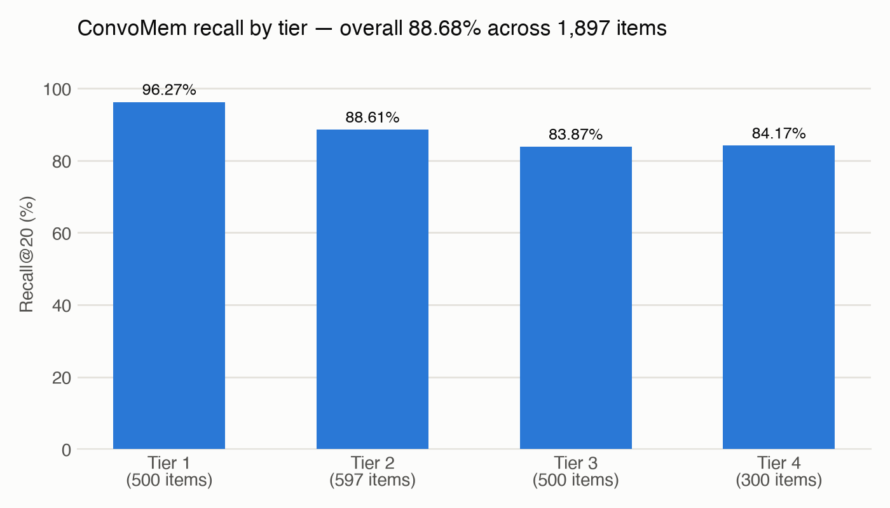
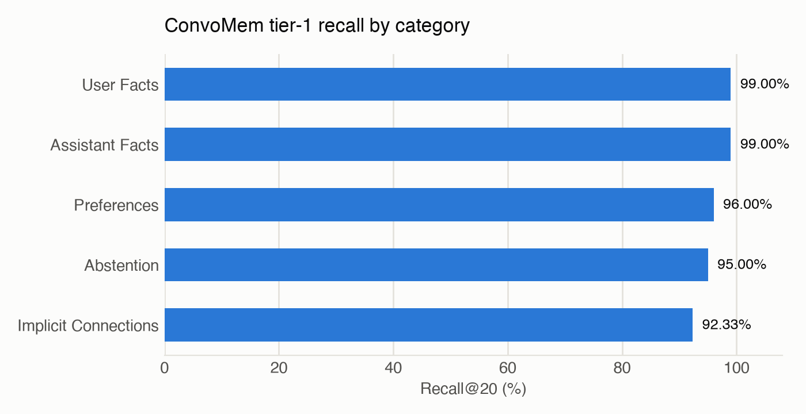
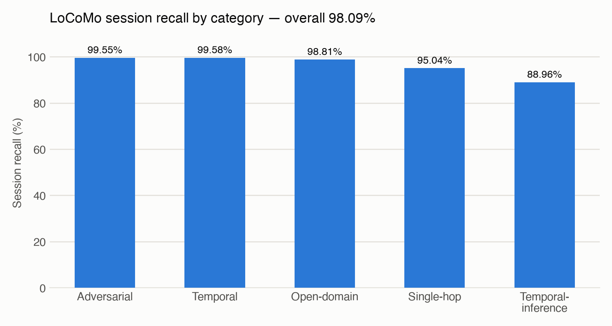
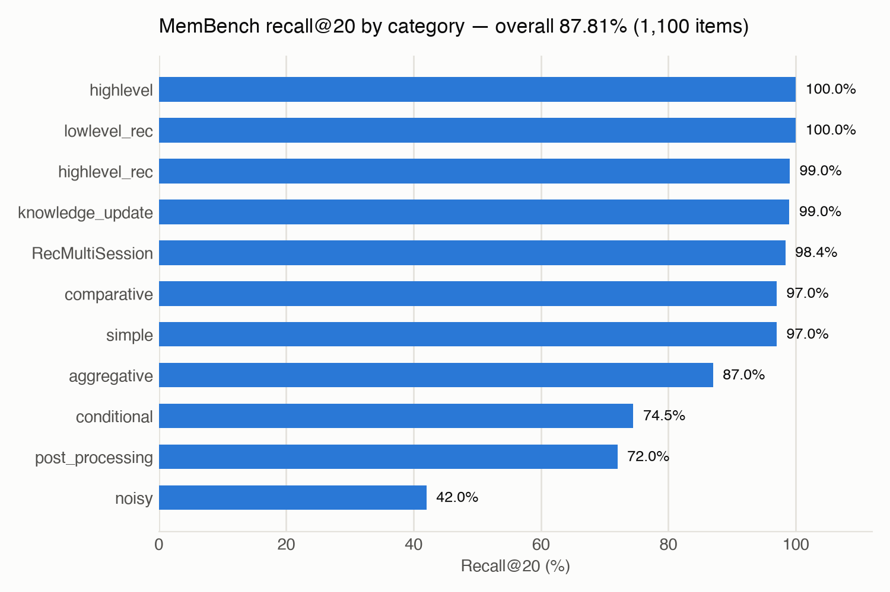

# 2026-08 benchmark re-run

**Dates:** 2026-08-23 (first pass, `4400f39`) and 2026-08-26 (completed at `9754508`)
**Repository:** memory_kg @ `9754508` (v0.8.0, sqlite-vec, kgmodule-utils 0.18.0)
**Machine:** Apple M5 Max MacBook Pro, 64 GB RAM
**Trigger:** [`benchmarks/RETEST_PLAN.md`](../RETEST_PLAN.md) — internal number disagreements between
`README.md`, `RESULTS_SUMMARY.md`, and the external essay, plus no sqlite-vec parity runs for
LoCoMo or MemBench, plus the 2026-08-23 dependency relock (`c46e458`) never having been
benchmark-validated.

## Status

**All four benchmarks are verified at a single commit, `9754508` (HEAD).** Every metric is
within 0.03 pp of its prior value; the acceptance threshold was 0.5 pp.

| Benchmark | Claimed | Reproduced (HEAD) | Delta | Verdict |
|---|--:|--:|--:|---|
| LoCoMo (session recall) | 98.1% | 98.10% | +0.01 pp | PASS |
| MemBench (recall@20) | 87.7% | 87.80% | -0.01 pp | PASS |
| ConvoMem (tier-1 recall@20) | 96.3% | 96.30% | +0.03 pp | PASS |
| ConvoMem (all tiers, 1,897 items) | 88.7% | 88.69% | +0.02 pp | PASS |
| LongMemEval-S (R@5) | disputed: 98.4% vs. 97.6% | **98.2%** | -0.2 / +0.6 pp | RESOLVED |
| LongMemEval-S (R@10) | disputed: 99.4% vs. 99.2% | **99.2%** | -0.2 / 0.0 pp | RESOLVED |
| LongMemEval-S (NDCG@10) | disputed: 0.943 vs. 0.936 | **0.954** | +0.011 / +0.018 | RESOLVED |

LongMemEval-S: 19,195-session corpus, 528,083 nodes. R@1 90.4%, R@5 98.2%, R@10 99.2%,
recall_all@10 98.8%, NDCG@10 0.954, 4 misses in 500. Full write-up and the dispute
resolution are in [`RESULTS_SUMMARY.md`](../RESULTS_SUMMARY.md).

### Why the other three were re-run a second time

The 2026-08-23 LoCoMo/MemBench/ConvoMem runs happened at `4a8f79d`, which is *before*
`c7e61ad` (stream corpus parsing into SQLite). All three rebuild their graphs, so that
refactor sat in their build path unmeasured, and the earlier claim in this file that all
four were "verified against the current code" was not strictly true. They were re-run at
HEAD on 2026-08-26 to close it.

`c7e61ad` is confirmed value-neutral. ConvoMem tiers 1 and 2 reproduce **per category and
per perfect-count**, not merely on the headline:

| Tier 1 category | April | HEAD |
|---|--:|--:|
| User Facts | 0.990 | 0.990 |
| Assistant Facts | 0.990 | 0.990 |
| Abstention | 0.950 | 0.950 |
| Preferences | 0.960 | 0.960 |
| Implicit Connections | 0.923 | 0.923 |
| **perfect** | **479/500** | **479/500** |

Tier 2 likewise (477/597 perfect, all six categories identical) and tier 4's perfect count
is unchanged at 181/300. The only movement is in tiers 3-4, at most 0.006 on a category --
the pre-existing cross-process nondeterminism in graph expansion documented in
[`BENCHMARKS_CONVOMEM.md`](../convomem/BENCHMARKS_CONVOMEM.md), which reproduces against
itself no better than this. Not attributable to the refactor.

This run also exercised the new per-batch GPU allocator eviction from `9754508`:
MemBench embedded 259,464 nodes in 4m43s without the allocator growth that had been
killing the LongMemEval-S build.

**How the dispute resolved.** The re-run reproduces the old "sibling boost" row exactly
on all three metrics. That row is canonical because the sibling boost is not optional --
it is applied unconditionally to multi-session questions at `longmemeval_memkg.py:911`,
with no flag to disable it, so the current code can only produce one number. The
98.4%/99.4%/0.943 set was the pre-sibling-boost code state; the 97.6% was never a
head-to-head figure at all but the last row of the progression table, which leaked into
the prose and the external essay as though it were the headline.

Both R@5 figures were within the plan's 0.5 pp threshold of the reproduced value, so
neither was a regression -- the disagreement was bookkeeping, not decay.

### Two defects found by re-running

1. **`write_corpus` miscounted the corpus under `--wipe`.** The intra-run dedup check was
   skipped entirely when `force=True`, so every duplicate haystack slot rewrote the same
   file and the log reported "23,867 unique sessions" for a corpus of **19,195**. The
   23,867 figure is the sum of per-question haystack slots. It had propagated into
   `RESULTS_SUMMARY.md` and the external essay. Fixed; the rebuilt corpus confirms 19,195
   files on disk.
2. **No GPU allocator eviction during embedding.** The MPS allocator caches freed blocks
   and never returns them, so the 528k-node embed grew unbounded until the machine
   swapped -- the reason the first two attempts had to be killed. `doc_kg` has evicted per
   batch since 0.16.x; `memory_kg` never picked it up. Fixed in `9754508`, which also adds
   the two-phase build so an interrupted run resumes from a JSONL cache instead of
   re-embedding.

## The README defect (fixed)

[`README.md`](../../README.md) claimed, in four places:

> MemoryKG achieves **100% retrieval recall on the ConvoMem benchmark — every evidence message
> found, on every question, across 17,463 items**

This was wrong, and was already known to be wrong: `benchmarks/convomem/BENCHMARKS_CONVOMEM.md`
documents that the 100%/17,463-item figure came from a scoring bug (an empty-node false match),
fixed 2026-04-26, with the corrected result being **96.3% tier-1 recall across 1,897 items**. Both
re-runs reproduce that corrected number exactly (96.27%, then 96.30% at HEAD), closing the question
of whether the fix still holds — it does. The README has now been corrected in all four places.

The 17,463 figure was the item count *before* the scoring fix; the real corpus is 1,897 items
across four tiers. Like the 23,867 session count in LongMemEval, it was an inflated denominator
that outlived the bug that produced it.

## Headline: claimed vs. reproduced



## ConvoMem — recall by tier



Tiers 1-2 reproduce the LanceDB-era per-item results exactly; tiers 3-4 differ by a handful of
items due to pre-existing cross-process nondeterminism in graph expansion (documented in
`BENCHMARKS_CONVOMEM.md`), not the sqlite-vec migration.



## LoCoMo — first sqlite-vec parity run

No LanceDB-era parity run existed for this benchmark before now.



At HEAD (1,986 questions, 272 session files, 20,011 nodes): 98.10% overall.
`temporal-inference` (89.0%, n=96) is the weakest category and `temporal` (99.6%) the
strongest — the split is between recalling *when* something happened and reasoning *from*
it, the same boundary LongMemEval's four remaining misses sit on.

## MemBench — first sqlite-vec parity run

No LanceDB-era parity run existed for this benchmark before now. `noisy` (42.0%) and
`post_processing` (72.0%) are the weakest categories, consistent with their intent (adversarial
distractors and multi-step synthesis) rather than a regression. Both reproduce exactly at HEAD.



At HEAD (1,100 items, 259,464 nodes): 87.80% overall, with `highlevel` and `lowlevel_rec`
both perfect (100/100) and `noisy` still the floor at 42.0%. Note 176/1,100 items (16.0%)
have turn counts at or below k=20 and are trivially perfect; the benchmark reports this
itself rather than burying it.

## Reproduce

```bash
cd /Users/egs/repos/memory_kg
env -u VIRTUAL_ENV -u POETRY_ACTIVE poetry install --sync --with dev

# LoCoMo
poetry run python benchmarks/locomobench/locomo_bench_memkg.py prepare \
  benchmarks/locomobench/data/locomo10.json --wipe
poetry run python benchmarks/locomobench/locomo_bench_memkg.py run \
  benchmarks/locomobench/data/locomo10.json

# MemBench
poetry run python benchmarks/membench/membench_bench.py all \
  --topic all --limit 100 --k 20 --wipe

# ConvoMem
poetry run python benchmarks/convomem/convomem_bench.py --tier 1 --k 20
poetry run python benchmarks/convomem/convomem_bench.py --tier 2 --k 20
poetry run python benchmarks/convomem/convomem_bench.py --tier 3 --k 20
poetry run python benchmarks/convomem/convomem_bench.py --tier 4 --k 20

# LongMemEval-S (2026-08-26). Build is three phases now; --keep-cache resumes
# from the JSONL embedding cache without re-embedding.
poetry run python benchmarks/longmemeval/longmemeval_memkg.py prepare \
  benchmarks/longmemeval/data/longmemeval_s_cleaned.json --wipe --chunk-strategy heading
poetry run python benchmarks/longmemeval/longmemeval_memkg.py run \
  benchmarks/longmemeval/data/longmemeval_s_cleaned.json \
  --out benchmarks/longmemeval/results_20260826_bge_haystack.jsonl
```

## Outstanding

- **ConvoMem can silently shrink its own denominator.** It is the only benchmark here that
  fetches its corpus over the network at run time; the other three read from checked-in
  `data/` directories. `discover_files()` catches *every* exception and returns `[]`, so a
  rate limit, timeout, or outage on a category that genuinely exists drops it from the run
  with nothing but a printed warning — and the reported recall is then an average over a
  smaller, differently-composed set. On this run three such warnings appeared and all three
  were legitimate (tier 4 really has only User/Assistant/Changing Facts), which is exactly
  what makes the failure mode dangerous: the benign case and the corrupting case look
  identical. Fix is small — assert the known per-tier totals (500 / 597 / 500 / 300) and
  fail loudly on a mismatch instead of averaging over whatever arrived. Filed, not done.
- **`BENCHMARKS.md`** describes the progression as ending at 98.4%; it should end at 98.2%.

Closed by this re-run: the ConvoMem README claim (corrected to 96.3% / 1,897 items in four
places), the LongMemEval-S run and its number dispute, the gap where LoCoMo, MemBench and
ConvoMem had never been measured against `c7e61ad`, and the LongMemEval-S article, which
was regenerated from the canonical numbers (99.2% R@10, 0.954 NDCG@10, 4 misses) and now
carries a note recording what it supersedes and why.
